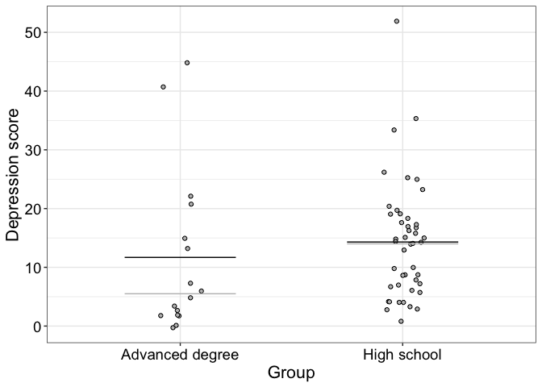

Group comparison example
================
Guillaume A. Rousselet & Rand R. Wilcox
2024-05-22

# Dependencies

``` r
library(tibble)
library(ggplot2)
source("./code/functions.R")
source("./code/theme_gar.txt")
```

# Load data

Data from Clark et al. (2012).

``` r
A1 <- read.table(file = "./data/A1_dat.txt")
a <- fac2list(A1$CESD,A1$edugp)
```

    ## [1] "Group Levels:"
    ## [1] 1 2 3 4 5

# Illustrate results

Horizontal black = means. Horizontal grey = medians.

``` r
df <- tibble(gp = factor(c(rep("High school", length(a[[2]])), rep("Advanced degree", length(a[[5]])))),
             score = c(a[[2]],a[[5]]))

ggplot(df, aes(x=gp, y=score)) + theme_gar +
  geom_jitter(shape = 21, width = 0.1, fill = "grey") +
  stat_summary(fun = "mean", geom = "crossbar", width = 0.5, size = 0.2) +
  stat_summary(fun = "median", geom = "crossbar", width = 0.5, size = 0.2, colour = "grey") +
  labs(x = "Group", y = "Depression score")
```

    ## Warning: Using `size` aesthetic for lines was deprecated in ggplot2 3.4.0.
    ## ℹ Please use `linewidth` instead.
    ## This warning is displayed once every 8 hours.
    ## Call `lifecycle::last_lifecycle_warnings()` to see where this warning was
    ## generated.

<!-- -->

# Cohen’s d

``` r
akp.effect(a[[2]],a[[5]],tr=0)
```

    ## [1] 0.2369866

# Trimmed mean version of Cohen’s d

Method from Algina et al. (2005).

``` r
akp.effect(a[[2]],a[[5]],tr=0.2)
```

    ## [1] 0.5662856

# References

Algina, J., Keselman, H. J., & Penfield, R. D. (2005). An Alternative to
Cohen’s Standardized Mean Difference Effect Size: A Robust Parameter and
Confidence Interval in the Two Independent Groups Case. Psychological
Methods, 10(3), 317–328. <https://doi.org/10.1037/1082-989X.10.3.317>

Clark, F., Jackson, J., Carlson, M., Chou, C.-P., Cherry, B. J.,
Jordan-Marsh, M., Knight, B. G., Mandel, D., Blanchard, J., Granger, D.
A., Wilcox, R. R., Lai, M. Y., White, B., Hay, J., Lam, C., Marterella,
A., & Azen, S. P. (2012). Effectiveness of a lifestyle intervention in
promoting the well-being of independently living older people: Results
of the Well Elderly 2 Randomised Controlled Trial. J Epidemiol Community
Health, 66(9), 782–790. <https://doi.org/10.1136/jech.2009.099754>
