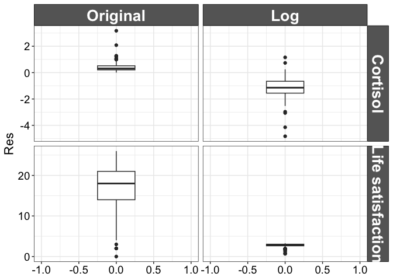
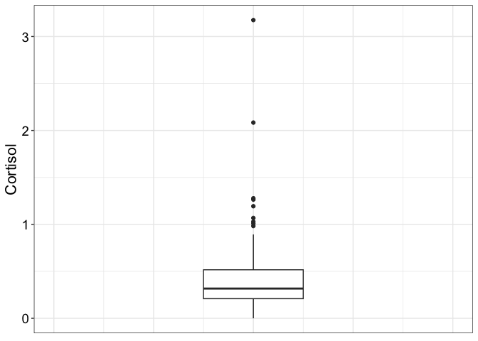
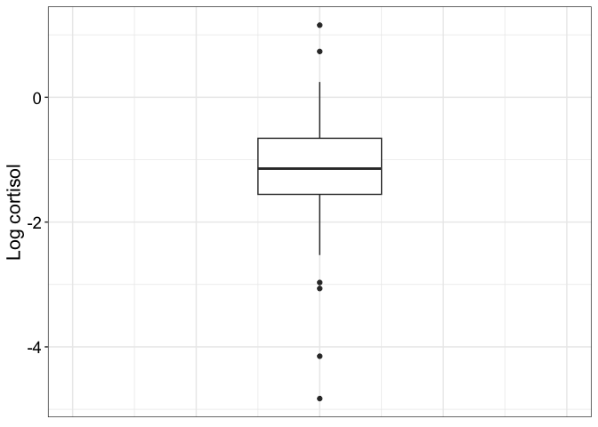
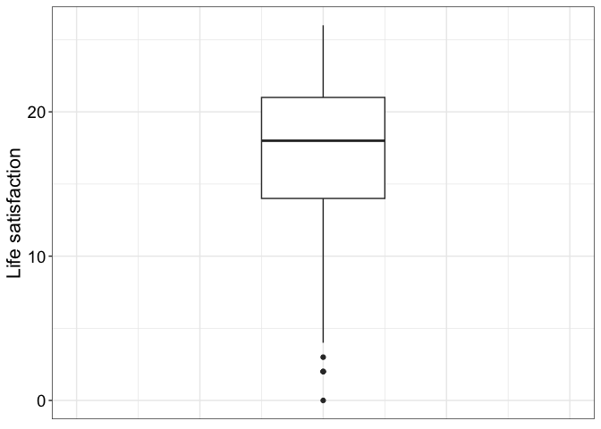
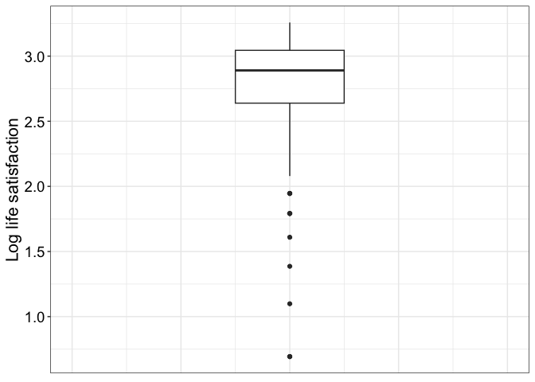
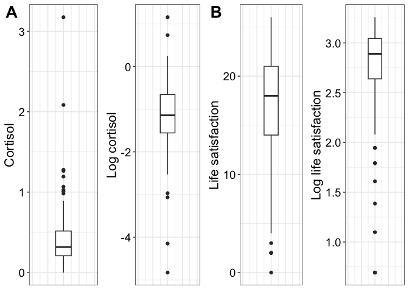

Log data transformation: cortisol and life satisfaction examples
================
Guillaume A. Rousselet & Rand R. Wilcox
2024-05-22

- [Dependencies](#dependencies)
- [Load data](#load-data)
- [Plot distributions](#plot-distributions)
  - [One grid plot](#one-grid-plot)
  - [Multiple panels](#multiple-panels)
- [Variance cortisol](#variance-cortisol)
- [Variance life satisfaction](#variance-life-satisfaction)
- [References](#references)

# Dependencies

``` r
library(tibble)
library(ggplot2)
library(cowplot)
source("./code/theme_gar.txt")
source("./code/functions.R")
```

# Load data

Data from Clark et al. (2012).

``` r
A1 <- read.table(file = "./data/A1_dat.txt")
# boxplot(A1$cort1,log(A1$cort1))
# boxplot(A1$LSIZ,log(A1$LSIZ))
```

# Plot distributions

## One grid plot

``` r
res.cort <- na.omit(A1$cort1)
res.ls <- na.omit(A1$LSIZ)
n.cort <- length(res.cort)
n.ls <- length(res.ls)

df <- tibble(Measurement = factor(c(rep("Cortisol", n.cort*2), rep("Life satisfaction", n.ls*2))),
             Unit = factor(c(rep("Original", n.cort),rep("Log", n.cort),
                             rep("Original", n.ls),rep("Log", n.ls))),
             Res = c(res.cort, log(res.cort), res.ls, log(res.ls))
             )

df$Unit <- keeporder(df$Unit)

ggplot(df, aes(y = Res)) + theme_gar +
  geom_boxplot(width = 0.5) +
  xlim(-1, 1) + 
  facet_grid(cols = vars(Unit),
             rows = vars(Measurement),
             scales = "free"
             )
```

    ## Warning: Removed 2 rows containing non-finite values (`stat_boxplot()`).

<!-- -->

## Multiple panels

### Panel A

``` r
df <- tibble(y = res.cort)

pA <- ggplot(df, aes(y = y)) + theme_gar +
  geom_boxplot(width = 0.5) +
  xlim(-1, 1) +
  theme(axis.ticks.x = element_blank(),
        axis.text.x = element_blank()) +
  labs(y = "Cortisol")
pA
```

<!-- -->

### Panel B

``` r
df <- tibble(y = log(res.cort[res.cort>0]))

pB <- ggplot(df, aes(y = y)) + theme_gar +
  geom_boxplot(width = 0.5) +
  xlim(-1, 1) +
  theme(axis.ticks.x = element_blank(),
        axis.text.x = element_blank()) +
  labs(y = "Log cortisol")
pB
```

<!-- -->

### Panel C

``` r
df <- tibble(y = res.ls)

pC <- ggplot(df, aes(y = y)) + theme_gar +
  geom_boxplot(width = 0.5) +
  xlim(-1, 1) +
  theme(axis.ticks.x = element_blank(),
        axis.text.x = element_blank()) +
  labs(y = "Life satisfaction")
pC
```

<!-- -->

### Panel C

``` r
df <- tibble(y = log(res.ls[res.ls>0]))

pD <- ggplot(df, aes(y = y)) + theme_gar +
  geom_boxplot(width = 0.5) +
  xlim(-1, 1) +
  theme(axis.ticks.x = element_blank(),
        axis.text.x = element_blank()) +
  labs(y = "Log life satisfaction")
pD
```

<!-- -->

### Combine panels

``` r
cowplot::plot_grid(pA, pB, pC, pD,
                   labels = c("A", " ", "B", " "),
                   label_size = 20,
                   ncol = 4)
```

<!-- -->

``` r
ggsave(filename = "./figures/logtrans.pdf", width = 9, height = 5)
```

# Variance cortisol

``` r
var(res.cort,na.rm = TRUE)
```

    ## [1] 0.1182568

``` r
var(log(res.cort[res.cort>0]),na.rm = TRUE)
```

    ## [1] 0.5652808

# Variance life satisfaction

``` r
var(res.ls, na.rm = TRUE)
```

    ## [1] 30.92758

``` r
var(log(res.ls[res.ls>0]),na.rm = TRUE)
```

    ## [1] 0.1962504

# References

Clark, F., Jackson, J., Carlson, M., Chou, C.-P., Cherry, B. J.,
Jordan-Marsh, M., Knight, B. G., Mandel, D., Blanchard, J., Granger, D.
A., Wilcox, R. R., Lai, M. Y., White, B., Hay, J., Lam, C., Marterella,
A., & Azen, S. P. (2012). Effectiveness of a lifestyle intervention in
promoting the well-being of independently living older people: Results
of the Well Elderly 2 Randomised Controlled Trial. J Epidemiol Community
Health, 66(9), 782–790. <https://doi.org/10.1136/jech.2009.099754>
