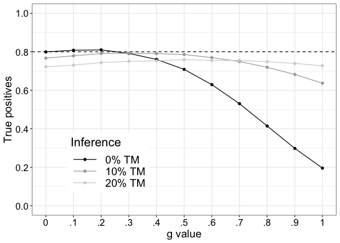
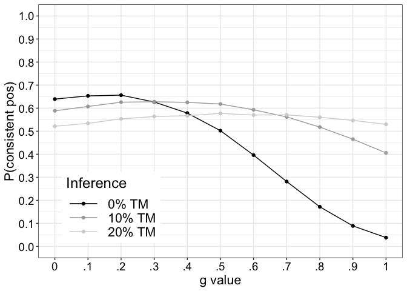
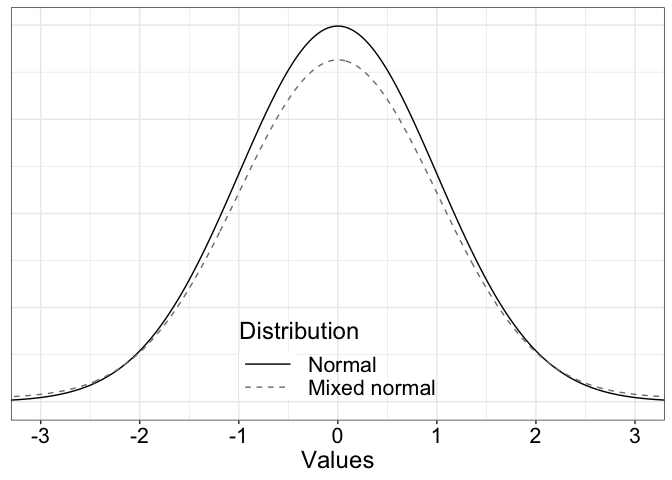
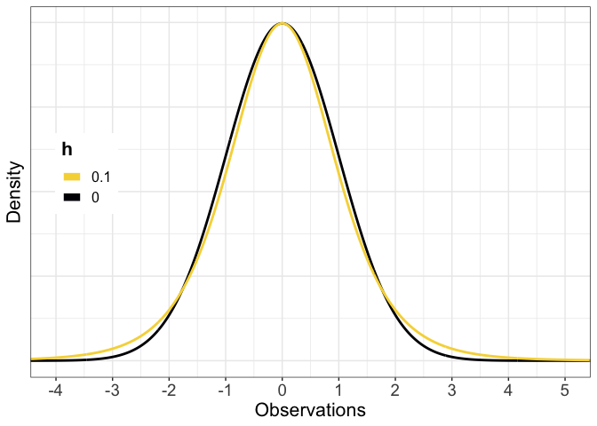

You get the symptoms of a replication crisis even when there isn’t one:
considering power
================
Guillaume A. Rousselet & Rand R. Wilcox
2024-05-22

- [Dependencies](#dependencies)
- [Low replication rates even in the absence of replication
  issues](#low-replication-rates-even-in-the-absence-of-replication-issues)
  - [Plot replication as a function of
    power](#plot-replication-as-a-function-of-power)
- [How skewness affects decision
  consistency](#how-skewness-affects-decision-consistency)
  - [Illustrate populations](#illustrate-populations)
  - [Simulation](#simulation)
  - [Results](#results)
- [Summary figures](#summary-figures)
- [Effects of outliers on decision
  consistency](#effects-of-outliers-on-decision-consistency)
  - [Illustrate normal and contaminated normal
    populations](#illustrate-normal-and-contaminated-normal-populations)
  - [Simulation](#simulation-1)
  - [Results](#results-1)
- [How skewness and outliers affect decision
  consistency](#how-skewness-and-outliers-affect-decision-consistency)
  - [Illustrate population](#illustrate-population)
  - [Simulation](#simulation-2)
  - [Results](#results-2)
- [References](#references)

# Dependencies

``` r
library(tibble)
library(ggplot2)
library(pwr)
source("./code/functions.R")
source("./code/theme_gar.txt")
# wrapper functions around code from Yuan Yan <yuan.yan@dal.ca>
# Reference:
# Yan, Yuan, and Marc G. Genton. ‘The Tukey g-and-h Distribution’. Significance 16, no. 3 (2019): 12–13. https://doi.org/10.1111/j.1740-9713.2019.01273.x.
source("./code/makeghfig.R") 
# extra packages needed to plot the g-and-h pdf:
library(LambertW)
```

    ## Loading required package: MASS

    ## This is 'LambertW' version 0.6.7.1. See the NEWS file and citation("LambertW").

``` r
library(gsl)
library(nleqslv)
```

# Low replication rates even in the absence of replication issues

Perspective from Greenland et al. (2016; see also Amrhein et al. 2019):

“if the alternative is correct and the actual power of two studies is
80%, the chance that the studies will both show $P \le 0.05$ will at
best be only 0.80(0.80) = 64%; furthermore, the chance that one study
shows $P \le 0.05$ and the other does not (and thus will be
misinterpreted as showing conflicting results) is 2(0.80)0.20 = 32% or
about 1 chance in 3.”

Probability that two studies will both lead to $p \le 0.05$ = 0.80 \*
0.80 = 0.64.  
Conflicting results in 2 \* 0.80 \* 0.20 = 0.32.

## Plot replication as a function of power

Plot probability of consistent and inconsistent results as a function of
power.

``` r
power.vec <- seq(0.05, 0.95, 0.05)
np <- length(power.vec)

df <- tibble(x = c(power.vec, power.vec),
             y = c(power.vec^2, 2*power.vec*(1-power.vec)),
             Result = factor(rep(c("Consistent", "Inconsistent"), each = np)))

p.80 <- ggplot(df, aes(x=x, y=y, colour = Result, fill = Result)) + theme_gar +
  geom_line() +
  geom_point(shape = 21) +
  coord_cartesian(xlim = c(0,1), ylim = c(0, 1)) +
  scale_x_continuous(breaks = power.vec, minor_breaks = NULL, 
                     labels = c(".05", "",".15", "",".25", "",".35", "",".45", "",".55", "",".65", "",".75", "",".85", "",".95")) +
  scale_y_continuous(breaks = seq(0, 1, 0.1)) +
  labs(x = "Power", y = "Probability") +
  scale_fill_manual(values = c("black", "grey")) +
  scale_colour_manual(values = c("black", "grey")) +
  theme(legend.position = c(.25,.8),
        panel.grid.minor.y = element_blank())
p.80
```

<!-- -->

When deciding about consistency between experiments using statistical
significance, the probability to reach the correct decision depends on
power, and unless power is very high, we will often be wrong.

In practice, the situation is probably worse, because power analyses are
typically performed assuming parametric assumptions are met, so the
power will be lower than expected – see simulations in Rousselet &
Wilcox (2020); Wilcox & Rousselet (2023); Rousselet, Pernet & Wilcox
(2023). The next section looks at decision consistency as a function of
population skewness, which can strongly affect power.

Why consider power as low as 5%? If that seems unrealistic, a search for
n=3 or n=4 in Nature and Science magazines will reveal recent
experiments carried out with very small sample sizes in the biological
sciences. Also, in psychology, interactions require much larger sample
sizes than often used, for instance when comparing correlation
coefficients (Rousselet, Pernet & Wilcox, 2023). So very low power is
still a real concern.

# How skewness affects decision consistency

Use `g-and-h` distributions. See details in Rousselet & Wilcox (2020)
and Yan & Genton (2019).

## Illustrate populations

``` r
p.gh <- plot_g_pdf(gvec = seq(0, 1, 0.1), h = 0) 
p.gh
```

<!-- -->

## Simulation

``` r
set.seed(777)
gvec <- seq(0, 1, 0.1) # g values to consider
ng <- length(gvec)
h <- 0 # fixed h value
nsim <- 100000 # simulation iterations
n <- 20 # sample size
targ.pow <- 0.8 # target power
# es <- 0.7 # effect size
aat <- 0.05 # arbitrary alpha threshold
es <- pwr.t.test(n=n, power=targ.pow, sig.level=aat, type="one.sample", alternative="two.sided")$d
simres.fp <- array(data = NA, dim = c(nsim, ng, 3))
simres.tp <- array(data = NA, dim = c(nsim, ng, 3))

for(G in 1:ng){
  g <- gvec[G]
  # trimmed mean of g-and-h population
  tm0 <- ghmean(g=g, h=h)$mean
  tm10 <- ghtrim(tr=0.1, g=g, h=h)
  tm20 <- ghtrim(tr=0.2, g=g, h=h)
  
  for(S in 1:nsim){
    samp <- ghdist(n, g = g, h = h)
    # one-sample t-test on trimmed means 
    # change null.value depending on amount of trimming
    # FALSE POSITIVES
    simres.fp[S,G,1] <- trimci.pval(samp, tr = 0, null.value = tm0) <= aat
    simres.fp[S,G,2] <- trimci.pval(samp, tr = 0.1, null.value = tm10) <= aat
    simres.fp[S,G,3] <- trimci.pval(samp, tr = 0.2, null.value = tm20) <= aat
    # TRUE POSITIVES
    simres.tp[S,G,1] <- trimci.pval(samp + es, tr = 0, null.value = tm0) <= aat
    simres.tp[S,G,2] <- trimci.pval(samp + es, tr = 0.1, null.value = tm10) <= aat
    simres.tp[S,G,3] <- trimci.pval(samp + es, tr = 0.2, null.value = tm20) <= aat
  }
}

save(simres.fp, simres.tp, gvec, ng, aat,
     file = "./data/nocrisis_gh.RData")
```

## Results

### Load simulation results

``` r
load(file = "./data/nocrisis_gh.RData")
```

### False positives

``` r
df <- tibble(g = rep(gvec, 3),
             Prob = as.vector(apply(simres.fp, c(2,3), mean)),
             Inference = factor(rep(c("0% TM", "10% TM", "20% TM"), each = ng)))

g.lab <- c("0", ".1", ".2", ".3", ".4", ".5", ".6", ".7", ".8", ".9", "1")

p.fp <- ggplot(df, aes(x=g, y=Prob, colour = Inference, fill = Inference)) + theme_gar +
  geom_hline(yintercept = aat, linetype = "dashed") +
  geom_line() +
  geom_point(shape = 21) +
  coord_cartesian(xlim = c(0,1), ylim = c(0, .2)) +
  scale_x_continuous(breaks = gvec, minor_breaks = NULL, labels = g.lab) +
  # labels = c("0", "",".1", "",".2", "",".3", "",".4", "",".5", "",".6", "",".7", "",".8", "",".9", "", "1")
  labs(x = "g value", y = "False positives") +
  scale_fill_manual(values = c("black", "darkgrey","lightgrey")) +
  scale_colour_manual(values = c("black", "darkgrey", "lightgrey")) +
  theme(legend.position = c(.2,.8))
p.fp
```

<!-- -->

### Power

``` r
df <- tibble(g = rep(gvec, 3),
             Prob = as.vector(apply(simres.tp, c(2,3), mean)),
             Inference = factor(rep(c("0% TM", "10% TM", "20% TM"), each = ng)))

p.tp <- ggplot(df, aes(x=g, y=Prob, colour = Inference, fill = Inference)) + theme_gar +
  geom_hline(yintercept = .8, linetype = "dashed") +
  geom_line() +
  geom_point(shape = 21) +
  coord_cartesian(xlim = c(0,1), ylim = c(0, 1)) +
  scale_x_continuous(breaks = gvec, minor_breaks = NULL, labels = g.lab) +
  # labels = c("0", "",".1", "",".2", "",".3", "",".4", "",".5", "",".6", "",".7", "",".8", "",".9", "", "1")
  scale_y_continuous(breaks = seq(0,1,0.2)) +
  labs(x = "g value", y = "True positives") +
  scale_fill_manual(values = c("black", "darkgrey","lightgrey")) +
  scale_colour_manual(values = c("black", "darkgrey", "lightgrey")) +
  theme(legend.position = c(.25,.25))
p.tp
```

<!-- -->

### P(consistent pos)

Probability of a positive outcome in both experiments.

``` r
df <- tibble(g = rep(gvec, 3),
             Prob = as.vector(apply(simres.tp, c(2,3), mean))^2,
             Inference = factor(rep(c("0% TM", "10% TM", "20% TM"), each = ng)))

p.cons <- ggplot(df, aes(x=g, y=Prob, colour = Inference, fill = Inference)) + 
  theme_gar +
  geom_line() +
  geom_point(shape = 21) +
  coord_cartesian(xlim = c(0,1), ylim = c(0,1)) +
  scale_x_continuous(breaks = gvec, minor_breaks = NULL, labels = g.lab) +
  # labels = c("0", "",".1", "",".2", "",".3", "",".4", "",".5", "",".6", "",".7", "",".8", "",".9", "", "1")
  scale_y_continuous(breaks = seq(0, 1, 0.1)) +
  labs(x = "g value", y = "P(consistent pos)") +
  scale_fill_manual(values = c("black", "darkgrey","lightgrey")) +
  scale_colour_manual(values = c("black", "darkgrey", "lightgrey")) +
  theme(legend.position = c(.2,.2))
p.cons
```

<!-- -->

### P(inconsistent)

Probability of a positive outcome in one experiment and a negative
outcome in the other one.

``` r
powres <- as.vector(apply(simres.tp, c(2,3), mean))

df <- tibble(g = rep(gvec, 3),
             Prob = 2*powres*(1-powres),
             Inference = factor(rep(c("0% TM", "10% TM", "20% TM"), each = ng)))

p.incons <- ggplot(df, aes(x=g, y=Prob, colour = Inference, fill = Inference)) + theme_gar +
  geom_line() +
  geom_point(shape = 21) +
  coord_cartesian(xlim = c(0,1), ylim = c(0,1)) +
  scale_x_continuous(breaks = gvec, minor_breaks = NULL, labels = g.lab) +
  # labels = c("0", "",".1", "",".2", "",".3", "",".4", "",".5", "",".6", "",".7", "",".8", "",".9", "", "1")
  scale_y_continuous(breaks = seq(0, 1, 0.1)) +
  labs(x = "g value", y = "P(inconsistent)") +
  scale_fill_manual(values = c("black", "darkgrey","lightgrey")) +
  scale_colour_manual(values = c("black", "darkgrey", "lightgrey")) +
  theme(legend.position = c(.2,.8))
p.incons
```

<!-- -->

# Summary figures

``` r
cowplot::plot_grid(p.80 + theme(legend.position = c(.3,.8)), 
                   p.gh + theme(legend.position = c(.8, .65)) +
                     guides(colour = guide_legend(ncol = 2, byrow = TRUE,
                                                  override.aes = list(linewidth = 4))) +
                     theme(legend.key.width = unit(1, "cm")),
                   p.tp, p.fp + theme(legend.position = "none"),
                   p.cons + theme(legend.position = "none"), 
                   p.incons + theme(legend.position = "none"),
                   labels = c("A", "B", "C", "D", "E", "F"),
                   label_size = 20,
                   ncol = 2)
ggsave(filename = "./figures/nocrisis.pdf", width = 9, height = 12)
```

# Effects of outliers on decision consistency

Now we sample from a contaminated normal population (also called a mixed
normal distribution), given a sample size of $n=20$. We consider
one-sample t-tests on means, 10% trimmed means and 20% trimmed means.

## Illustrate normal and contaminated normal populations

``` r
x <- seq(-5,5,0.01)
n <- length(x)
y.norm <- dnorm(x)
y.cnorm <- 0.9*dnorm(x) + .1*dnorm(x,0,10)

df <- tibble(x = c(x,x), 
             y = c(y.norm, y.cnorm),
             Distribution = factor(rep(c("Normal", "Mixed normal"), each = n)))

df$Distribution <- keeporder(df$Distribution) 

ggplot(df, aes(x = x, y = y, colour = Distribution, linetype = Distribution)) +
  theme_gar + 
  geom_line() +
  # formatting
  scale_colour_manual(values=c("black", "grey50")) + 
  scale_linetype_manual(values = c("solid", "dashed")) +
  theme(axis.text = element_text(size = 16),
        axis.title = element_text(size = 18),
        plot.title = element_text(size=20),
        axis.text.y = element_blank(),
        axis.ticks.y = element_blank(),
        axis.title.y = element_blank(),
        legend.position = c(0.5, 0.15),
        legend.background = element_rect(fill=alpha(0.4))) +
  labs(x = "Values") + # y = "Density") +
  scale_x_continuous(breaks = seq(-3, 3, 1)) +
  coord_cartesian(xlim = c(-3, 3))
```

<!-- -->

``` r
ggsave(filename = "./figures/cnorm.pdf", width = 9, height = 5)
```

## Simulation

``` r
set.seed(777)
nsim <- 100000 # simulation iterations
n <- 20 # sample size
targ.pow <- 0.8 # target power
aat <- 0.05 # arbitrary alpha threshold
es <- pwr.t.test(n=n, power=targ.pow, sig.level=aat, type="one.sample", alternative="two.sided")$d
simres.fp <- array(data = NA, dim = c(nsim, 2, 3)) # nsim x norm/cnrom x m/10tm/20tm
simres.tp <- array(data = NA, dim = c(nsim, 2, 3)) # nsim x norm/cnrom x m/10tm/20tm
tm0 <- 0
tm10 <- 0
tm20 <- 0

for(S in 1:nsim){
  
  # Normal population
  samp <- rnorm(n, mean = 0, sd = 1)
  # one-sample t-test on trimmed means 
  # change null.value depending on amount of trimming
  # FALSE POSITIVES
  simres.fp[S,1,1] <- trimci.pval(samp, tr = 0, null.value = tm0) <= aat
  simres.fp[S,1,2] <- trimci.pval(samp, tr = 0.1, null.value = tm10) <= aat
  simres.fp[S,1,3] <- trimci.pval(samp, tr = 0.2, null.value = tm20) <= aat
  # TRUE POSITIVES
  simres.tp[S,1,1] <- trimci.pval(samp + es, tr = 0, null.value = tm0) <= aat
  simres.tp[S,1,2] <- trimci.pval(samp + es, tr = 0.1, null.value = tm10) <= aat
  simres.tp[S,1,3] <- trimci.pval(samp + es, tr = 0.2, null.value = tm20) <= aat
  
  # Contaminated normal population
  samp <- cnorm(n)
  # one-sample t-test on trimmed means 
  # change null.value depending on amount of trimming
  # FALSE POSITIVES
  simres.fp[S,2,1] <- trimci.pval(samp, tr = 0, null.value = tm0) <= aat
  simres.fp[S,2,2] <- trimci.pval(samp, tr = 0.1, null.value = tm10) <= aat
  simres.fp[S,2,3] <- trimci.pval(samp, tr = 0.2, null.value = tm20) <= aat
  # TRUE POSITIVES
  simres.tp[S,2,1] <- trimci.pval(samp + es, tr = 0, null.value = tm0) <= aat
  simres.tp[S,2,2] <- trimci.pval(samp + es, tr = 0.1, null.value = tm10) <= aat
  simres.tp[S,2,3] <- trimci.pval(samp + es, tr = 0.2, null.value = tm20) <= aat
}

save(simres.fp, simres.tp, aat,
     file = "./data/nocrisis_cnorm.RData")
```

## Results

### Power

``` r
load(file = "./data/nocrisis_cnorm.RData")
powres <- apply(simres.tp, c(2,3), mean)
powres
```

    ##         [,1]    [,2]    [,3]
    ## [1,] 0.79991 0.76714 0.72075
    ## [2,] 0.32284 0.60842 0.61980

### Consistency for positive results

``` r
powres^2
```

    ##           [,1]      [,2]      [,3]
    ## [1,] 0.6398560 0.5885038 0.5194806
    ## [2,] 0.1042257 0.3701749 0.3841520

Under normality, as before given 80% power, assuming a true effect, two
studies will report consistently positive results in only 64% of the
time, dropping to 58.9% for 10% trimmed means, and 51.9% for 20% trimmed
means.

When sampling from a contaminated normal population, now power is only
32.3% for the mean, but remains high at 60.8% for the 10% trimmed mean
and 62% for the 20% trimmed mean. As a result, positive decision
consistency drops to 10.4% for the mean, 37% for 10% trimmed means, and
38.4% for 20% trimmed means.

# How skewness and outliers affect decision consistency

Use g-and-h distributions. See details in Rousselet & Wilcox (2020). Now
h = 0.1, so outliers are more likely than in the previous `g-and-h`
simulation. Not surprisingly, replication success based on statistical
significance gets worse when sampling from distributions with heavier
tails.

## Illustrate population

``` r
plot_h_pdf(hvec = c(0, 0.1))
```

<!-- -->

## Simulation

``` r
set.seed(777)
gvec <- seq(0, 1, 0.1) # g values to consider
ng <- length(gvec)
h <- 0.1 # fixed h value
nsim <- 100000 # simulation iterations
n <- 20 # sample size
targ.pow <- 0.8 # target power
# es <- 0.7 # effect size
aat <- 0.05 # arbitrary alpha threshold
es <- pwr.t.test(n=n, power=targ.pow, sig.level=aat, type="one.sample", alternative="two.sided")$d
simres.fp <- array(data = NA, dim = c(nsim, ng, 3))
simres.tp <- array(data = NA, dim = c(nsim, ng, 3))

for(G in 1:ng){
  g <- gvec[G]
  # trimmed mean of g-and-h population
  tm0 <- ghmean(g=g, h=h)$mean
  tm10 <- ghtrim(tr=0.1, g=g, h=h)
  tm20 <- ghtrim(tr=0.2, g=g, h=h)
  
  for(S in 1:nsim){
    samp <- ghdist(n,g = g, h = h)
    # one-sample t-test on trimmed means 
    # change null.value depending on amount of trimming
    # FALSE POSITIVES
    simres.fp[S,G,1] <- trimci.pval(samp, tr = 0, null.value = tm0) <= aat
    simres.fp[S,G,2] <- trimci.pval(samp, tr = 0.1, null.value = tm10) <= aat
    simres.fp[S,G,3] <- trimci.pval(samp, tr = 0.2, null.value = tm20) <= aat
    # TRUE POSITIVES
    simres.tp[S,G,1] <- trimci.pval(samp + es, tr = 0, null.value = tm0) <= aat
    simres.tp[S,G,2] <- trimci.pval(samp + es, tr = 0.1, null.value = tm10) <= aat
    simres.tp[S,G,3] <- trimci.pval(samp + es, tr = 0.2, null.value = tm20) <= aat
  }
}

save(simres.fp, simres.tp, gvec, ng, aat,
     file = "./data/nocrisis_gh01.RData")
```

## Results

### Load simulation results

``` r
load(file = "./data/nocrisis_gh01.RData")
```

### False positives

``` r
df <- tibble(g = rep(gvec, 3),
             Prob = as.vector(apply(simres.fp, c(2,3), mean)),
             Inference = factor(rep(c("0% TM", "10% TM", "20% TM"), each = ng)))

ggplot(df, aes(x=g, y=Prob, colour = Inference, fill = Inference)) + theme_gar +
  geom_hline(yintercept = aat, linetype = "dashed") +
  geom_line() +
  geom_point(shape = 21) +
  coord_cartesian(xlim = c(0,1), ylim = c(0, .2)) +
  scale_x_continuous(breaks = gvec, minor_breaks = NULL) +
  # labels = c("0", "",".1", "",".2", "",".3", "",".4", "",".5", "",".6", "",".7", "",".8", "",".9", "", "1")
  labs(x = "g value", y = "False positives") +
  scale_fill_manual(values = c("black", "darkgrey","lightgrey")) +
  scale_colour_manual(values = c("black", "darkgrey", "lightgrey")) +
  theme(legend.position = c(.2,.8))
```

<!-- -->

### Power

``` r
df <- tibble(g = rep(gvec, 3),
             Prob = as.vector(apply(simres.tp, c(2,3), mean)),
             Inference = factor(rep(c("0% TM", "10% TM", "20% TM"), each = ng)))

ggplot(df, aes(x=g, y=Prob, colour = Inference, fill = Inference)) + theme_gar +
  geom_hline(yintercept = .8, linetype = "dashed") +
  geom_line() +
  geom_point(shape = 21) +
  coord_cartesian(xlim = c(0,1), ylim = c(0, 1)) +
  scale_x_continuous(breaks = gvec, minor_breaks = NULL) +
  # labels = c("0", "",".1", "",".2", "",".3", "",".4", "",".5", "",".6", "",".7", "",".8", "",".9", "", "1")
  scale_y_continuous(breaks = seq(0,1,0.2)) +
  labs(x = "g value", y = "True positives") +
  scale_fill_manual(values = c("black", "darkgrey","lightgrey")) +
  scale_colour_manual(values = c("black", "darkgrey", "lightgrey")) +
  theme(legend.position = c(.2,.2))
```

<!-- -->

### P(consistent pos)

``` r
df <- tibble(g = rep(gvec, 3),
             Prob = as.vector(apply(simres.tp, c(2,3), mean))^2,
             Inference = factor(rep(c("0% TM", "10% TM", "20% TM"), each = ng)))

ggplot(df, aes(x=g, y=Prob, colour = Inference, fill = Inference)) + theme_gar +
  geom_line() +
  geom_point(shape = 21) +
  coord_cartesian(xlim = c(0,1), ylim = c(0,1)) +
  scale_x_continuous(breaks = gvec, minor_breaks = NULL) +
  # labels = c("0", "",".1", "",".2", "",".3", "",".4", "",".5", "",".6", "",".7", "",".8", "",".9", "", "1")
  scale_y_continuous(breaks = seq(0, 1, 0.1)) +
  labs(x = "g value", y = "P(consistent pos)") +
  scale_fill_manual(values = c("black", "darkgrey","lightgrey")) +
  scale_colour_manual(values = c("black", "darkgrey", "lightgrey")) +
  theme(legend.position = c(.2,.2))
```

<!-- -->

### P(inconsistent)

``` r
powres <- as.vector(apply(simres.tp, c(2,3), mean))

df <- tibble(g = rep(gvec, 3),
             Prob = 2*powres*(1-powres),
             Inference = factor(rep(c("0% TM", "10% TM", "20% TM"), each = ng)))

ggplot(df, aes(x=g, y=Prob, colour = Inference, fill = Inference)) + theme_gar +
  geom_line() +
  geom_point(shape = 21) +
  coord_cartesian(xlim = c(0,1), ylim = c(0,1)) +
  scale_x_continuous(breaks = gvec, minor_breaks = NULL) +
  # labels = c("0", "",".1", "",".2", "",".3", "",".4", "",".5", "",".6", "",".7", "",".8", "",".9", "", "1")
  scale_y_continuous(breaks = seq(0, 1, 0.1)) +
  labs(x = "g value", y = "P(inconsistent)") +
  scale_fill_manual(values = c("black", "darkgrey","lightgrey")) +
  scale_colour_manual(values = c("black", "darkgrey", "lightgrey")) +
  theme(legend.position = c(.2,.8))
```

<!-- -->

# References

Amrhein, V., Trafimow, D., & Greenland, S. (2019). Inferential
Statistics as Descriptive Statistics: There Is No Replication Crisis if
We Don’t Expect Replication. The American Statistician, 73(sup1),
262–270. <https://doi.org/10.1080/00031305.2018.1543137>

Greenland, S., Senn, S. J., Rothman, K. J., Carlin, J. B., Poole, C.,
Goodman, S. N., & Altman, D. G. (2016). Statistical tests, P values,
confidence intervals, and power: A guide to misinterpretations. European
Journal of Epidemiology, 31(4), 337–350.
<https://doi.org/10.1007/s10654-016-0149-3>

Rousselet, G., Pernet, C. R., & Wilcox, R. R. (2023). An introduction to
the bootstrap: A versatile method to make inferences by using
data-driven simulations. Meta-Psychology, 7.
<https://doi.org/10.15626/MP.2019.2058>

Rousselet, G. A., & Wilcox, R. R. (2020). Reaction Times and other
Skewed Distributions: Problems with the Mean and the Median.
Meta-Psychology, 4. <https://doi.org/10.15626/MP.2019.1630>

Wilcox, R. R., & Rousselet, G. A. (2023). An Updated Guide to Robust
Statistical Methods in Neuroscience. Current Protocols, 3(3), e719.
<https://doi.org/10.1002/cpz1.719>

Yan, Y., & Genton, M. G. (2019). The Tukey g-and-h distribution.
Significance, 16(3), 12–13.
<https://doi.org/10.1111/j.1740-9713.2019.01273.x>
