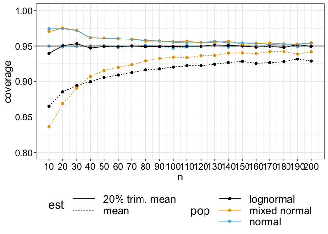
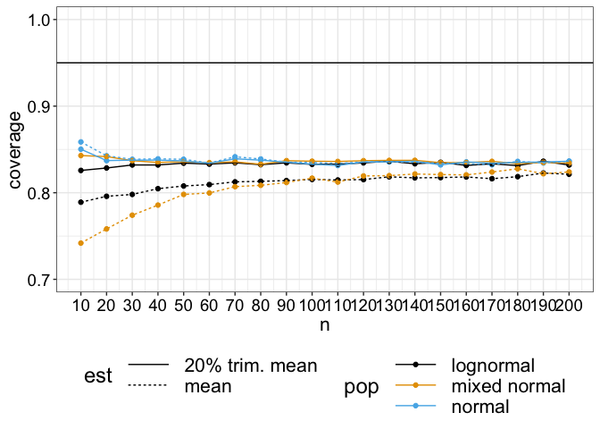

Prediction intervals
================
Guillaume A. Rousselet & Rand R. Wilcox
2024-05-22

# Dependencies

``` r
library(tibble)
library(ggplot2)
library(latex2exp)
library(beepr)
library(pwr)
source("./code/functions.R")
source("./code/theme_gar.txt")
```

# Prediction intervals

## Example from Spence & Stanley (2024)

Compute a one-sample prediction interval using means.  
<https://journals.sagepub.com/doi/10.1177/25152459231217932>

``` r
n1 <- 50
n2 <- 70
m1 <- 7.21
sd1 <- 2.20
ci <- predint(n1, n2, m1, sd1)
ci
```

    ## [1] 6.391378 8.028622

## One-sample prediction interval for a trimmed mean

In the `code` folder, the `functions.R` file contains the `predint.tm`
function, which computes a one-sample prediction interval for trimmed
means. Not used here, the function `mean2g.pred.ci` handles the
two-sample case.

Next chunk is to demonstrate the syntax of the function only. The
example from Spence & Stanley (2024) does not involve data, so the
matching trimmed mean and winsorized standard deviation cannot be
calculated.

``` r
tp <- 0.2 # 20% trimmed mean
m1 <- mean(samp1, trim = tp) # sample trimmed mean
sd1 <- winsd(samp1, tr = tp) # sample winsorized standard deviation
predint.tm(m1, sd1, n1, n2, tr = tp, alpha = 0.05)
```

# Simulation: normal distribution

In each simulation, perform 2 experiments. First experiment has $n1=30$,
second has $n2=30$. Consider one-sample case.

Consider these rules to indicate support for a replication:

- mean in sample 2, $m_2$, is contained in prediction interval from
  experiment 1;  
- $m_2$ is contained in the confidence interval from experiment 1.

Consider PI for means and 20% trimmed means.

``` r
set.seed(44)
nsim <- 50000
simres <- matrix(NA, nrow = nsim, 2)
simres.tm <- matrix(NA, nrow = nsim, 2)
n1 <- 30
n2 <- 30
tp <- 0.2 # trimming percentage
aat <- .05 # arbitrary alpha threshold 

for(S in 1:nsim){
  samp1 <- rnorm(n1)
  ci1 <- t.test(samp1)$conf.int
  m1 <- mean(samp1)
  sd1 <- sd(samp1)
  pi <- predint(n1, n2, m1, sd1)
  samp2 <- rnorm(n2)
  # ci2 <- t.test(samp2)$conf.int
  m2 <- mean(samp2)
  # rule 1: m2 contained in prediction interval
  simres[S,1] <- m2 >= pi[1] && m2 <= pi[2]
  pi <- predint.tm(M = mean(samp1, trim=tp), 
                   sd = winsd(samp1, tr = tp),
                   orig.n = n1, 
                   new.n = n2, 
                   tr = tp, 
                   alpha = aat)
  tm2 <- mean(samp2, trim = tp) # 20% trimmed mean in 20% PI?
  simres.tm[S] <- tm2 >= pi[1] && tm2 <= pi[2]
  # rule 2: m2 contained in confidence interval
  simres[S,2] <- m2 >= ci1[1] && m2 <= ci1[2]
  ci1 <- trimci(samp1, tr = tp, alpha = aat)$ci
  simres.tm[S,2] <- tm2 >= ci1[1] && tm2 <= ci1[2]
}
save(file = "./data/predint_norm.RData",
     simres, simres.tm)
```

## Results

``` r
load(file = "./data/predint_norm.RData")

# coverage
print("---Normal population---")
```

    ## [1] "---Normal population---"

``` r
print("inference on means:")
```

    ## [1] "inference on means:"

``` r
print("PI  /  CI")
```

    ## [1] "PI  /  CI"

``` r
round(apply(simres, 2, mean), digits = 3)
```

    ## [1] 0.951 0.843

``` r
print("inference on 20% trimmed means:")
```

    ## [1] "inference on 20% trimmed means:"

``` r
round(apply(simres.tm, 2, mean), digits = 3)
```

    ## [1] 0.973 0.839

Prediction interval works as intended, will nominal capture rate.  
Coverage using CI rule is too conservative, way below the 95% that could
(wrongly) be expected.  
Coverage of PI for 20% trimmed means is a bit liberal.

# Simulation: lognormal distribution

``` r
set.seed(44)
nsim <- 50000
simres <- matrix(NA, nrow = nsim, 2)
simres.tm <- matrix(NA, nrow = nsim, 2)
n1 <- 30
n2 <- 30
tp <- 0.2 # trimming percentage
aat <- .05 # arbitrary alpha threshold 

for(S in 1:nsim){
  samp1 <- rlnorm(n1)
  ci1 <- t.test(samp1)$conf.int
  m1 <- mean(samp1)
  sd1 <- sd(samp1)
  pi <- predint(n1, n2, m1, sd1)
  samp2 <- rlnorm(n2)
  # ci2 <- t.test(samp2)$conf.int
  m2 <- mean(samp2)
  # rule 1: m2 contained in prediction interval
  simres[S,1] <- m2 >= pi[1] && m2 <= pi[2]
  pi <- predint.tm(M = mean(samp1, trim=tp), 
                   sd = winsd(samp1, tr = tp),
                   orig.n = n1, 
                   new.n = n2, 
                   tr = tp, 
                   alpha = aat)
  tm2 <- mean(samp2, trim = tp) # 20% trimmed mean in 20% PI?
  simres.tm[S] <- tm2 >= pi[1] && tm2 <= pi[2]
  # rule 2: m2 contained in confidence interval
  simres[S,2] <- m2 >= ci1[1] && m2 <= ci1[2]
  ci1 <- trimci(samp1, tr = tp, alpha = aat)$ci
  simres.tm[S,2] <- tm2 >= ci1[1] && tm2 <= ci1[2]
}
save(file = "./data/predint_lnorm.RData",
     simres, simres.tm)
```

## Results

``` r
load(file = "./data/predint_lnorm.RData")

# coverage
print("---Lognormal population---")
```

    ## [1] "---Lognormal population---"

``` r
print("inference on means:")
```

    ## [1] "inference on means:"

``` r
print("PI  /  CI")
```

    ## [1] "PI  /  CI"

``` r
round(apply(simres, 2, mean), digits = 3)
```

    ## [1] 0.893 0.800

``` r
print("inference on 20% trimmed means:")
```

    ## [1] "inference on 20% trimmed means:"

``` r
round(apply(simres.tm, 2, mean), digits = 3)
```

    ## [1] 0.951 0.830

Coverage is lower under strong asymmetry for PI and CI methods on means.
CI overlap remains high. Coverage using 20% trimmed means is at the
nominal level.

# Simulation: contaminated normal distribution

See Wilcox & Rousselet (2023) for details.

``` r
set.seed(44)
nsim <- 50000
simres <- matrix(NA, nrow = nsim, 2)
simres.tm <- matrix(NA, nrow = nsim, 2)
n1 <- 30
n2 <- 30
tp <- 0.2 # trimming percentage
aat <- .05 # arbitrary alpha threshold 

for(S in 1:nsim){
  samp1 <- cnorm(n1)
  ci1 <- t.test(samp1)$conf.int
  m1 <- mean(samp1)
  sd1 <- sd(samp1)
  pi <- predint(n1, n2, m1, sd1)
  samp2 <- cnorm(n2)
  # ci2 <- t.test(samp2)$conf.int
  m2 <- mean(samp2)
  # rule 1: m2 contained in prediction interval
  simres[S,1] <- m2 >= pi[1] && m2 <= pi[2]
  pi <- predint.tm(M = mean(samp1, trim=tp), 
                   sd = winsd(samp1, tr = tp),
                   orig.n = n1, 
                   new.n = n2, 
                   tr = tp, 
                   alpha = aat)
  tm2 <- mean(samp2, trim = tp) # 20% trimmed mean in 20% PI?
  simres.tm[S] <- tm2 >= pi[1] && tm2 <= pi[2]
  # rule 2: m2 contained in confidence interval
  simres[S,2] <- m2 >= ci1[1] && m2 <= ci1[2]
  ci1 <- trimci(samp1, tr = tp, alpha = aat)$ci
  simres.tm[S,2] <- tm2 >= ci1[1] && tm2 <= ci1[2]
}
save(file = "./data/predint_cnorm.RData",
     simres, simres.tm)
```

## Results

``` r
load(file = "./data/predint_cnorm.RData")

# coverage
print("---Contaminated normal population---")
```

    ## [1] "---Contaminated normal population---"

``` r
print("inference on means:")
```

    ## [1] "inference on means:"

``` r
print("PI  /  CI")
```

    ## [1] "PI  /  CI"

``` r
round(apply(simres, 2, mean), digits = 3)
```

    ## [1] 0.895 0.779

``` r
print("inference on 20% trimmed means:")
```

    ## [1] "inference on 20% trimmed means:"

``` r
round(apply(simres.tm, 2, mean), digits = 3)
```

    ## [1] 0.971 0.838

Similar conclusion when outliers are common, though coverage is a bit
too high when using 20% trimmed means.

# Simulation: vary n

Inferences on means and 20% trimmed means.  
Sampling from normal, lognormal and contaminated normal populations.  
Two rules: CI and PI.

``` r
set.seed(44)
nsim <- 50000
nseq <- seq(10, 200, 10)
nn <- length(nseq)
simres.ci <- array(NA, dim = c(nsim, nn, 2, 3)) #nseq, m/tm, 3 pops
simres.pi <- array(NA, dim = c(nsim, nn, 2, 3))
tp <- 0.2 # trimming percentage
aat <- .05 # arbitrary alpha threshold 

for(S in 1:nsim){
  
  for(N in 1:nn){
    
    n <- nseq[N]
    
    # Normal population
    samp1 <- rnorm(n)
    ci1 <- t.test(samp1)$conf.int
    m1 <- mean(samp1)
    sd1 <- sd(samp1)
    pi <- predint(n, n, m1, sd1)
    samp2 <- rnorm(n)
    m2 <- mean(samp2)
    # rule 1: m2 contained in prediction interval
    simres.pi[S,N,1,1] <- m2 >= pi[1] && m2 <= pi[2]
    pi <- predint.tm(M = mean(samp1, trim=tp), 
                     sd = winsd(samp1, tr = tp),
                     orig.n = n, 
                     new.n = n, 
                     tr = tp, 
                     alpha = aat)
    tm2 <- mean(samp2, trim = tp) # 20% trimmed mean in 20% PI?
    simres.pi[S,N,2,1] <- tm2 >= pi[1] && tm2 <= pi[2]
    # rule 2: m2 contained in confidence interval
    simres.ci[S,N,1,1] <- m2 >= ci1[1] && m2 <= ci1[2]
    ci1 <- trimci(samp1, tr = tp, alpha = aat, pr = FALSE)$ci
    simres.ci[S,N,2,1] <- tm2 >= ci1[1] && tm2 <= ci1[2]
    
    # Lognormal population
    samp1 <- rlnorm(n)
    ci1 <- t.test(samp1)$conf.int
    m1 <- mean(samp1)
    sd1 <- sd(samp1)
    pi <- predint(n, n, m1, sd1)
    samp2 <- rlnorm(n)
    m2 <- mean(samp2)
    # rule 1: m2 contained in prediction interval
    simres.pi[S,N,1,2] <- m2 >= pi[1] && m2 <= pi[2]
    pi <- predint.tm(M = mean(samp1, trim=tp), 
                     sd = winsd(samp1, tr = tp),
                     orig.n = n, 
                     new.n = n, 
                     tr = tp, 
                     alpha = aat)
    tm2 <- mean(samp2, trim = tp) # 20% trimmed mean in 20% PI?
    simres.pi[S,N,2,2] <- tm2 >= pi[1] && tm2 <= pi[2]
    # rule 2: m2 contained in confidence interval
    simres.ci[S,N,1,2] <- m2 >= ci1[1] && m2 <= ci1[2]
    ci1 <- trimci(samp1, tr = tp, alpha = aat, pr = FALSE)$ci
    simres.ci[S,N,2,2] <- tm2 >= ci1[1] && tm2 <= ci1[2]
    
    # Contaminated normal population
    samp1 <- cnorm(n)
    ci1 <- t.test(samp1)$conf.int
    m1 <- mean(samp1)
    sd1 <- sd(samp1)
    pi <- predint(n, n, m1, sd1)
    samp2 <- cnorm(n)
    m2 <- mean(samp2)
    # rule 1: m2 contained in prediction interval
    simres.pi[S,N,1,3] <- m2 >= pi[1] && m2 <= pi[2]
    pi <- predint.tm(M = mean(samp1, trim=tp), 
                     sd = winsd(samp1, tr = tp),
                     orig.n = n, 
                     new.n = n, 
                     tr = tp, 
                     alpha = aat)
    tm2 <- mean(samp2, trim = tp) # 20% trimmed mean in 20% PI?
    simres.pi[S,N,2,3] <- tm2 >= pi[1] && tm2 <= pi[2]
    # rule 2: m2 contained in confidence interval
    simres.ci[S,N,1,3] <- m2 >= ci1[1] && m2 <= ci1[2]
    ci1 <- trimci(samp1, tr = tp, alpha = aat, pr = FALSE)$ci
    simres.ci[S,N,2,3] <- tm2 >= ci1[1] && tm2 <= ci1[2]
  }
}
save(file = "./data/predint_sim.RData",
     simres.ci, simres.pi, nseq, nn, nsim, aat, tp)
```

## Plot results: prediction interval rule

``` r
load(file = "./data/predint_sim.RData")

df <- tibble(coverage = as.vector(apply(simres.pi, c(2,3,4), mean)),
             est = factor(rep(rep(c("mean", "20% trim. mean"), each = nn), 3)),
             n = rep(nseq, 6),
             pop = rep(c("normal", "lognormal", "mixed normal"), each = nn*2)
)

ggplot(df, aes(x = n, y = coverage, colour = pop, linetype = est)) + theme_gar +
  geom_point() +
  geom_line() +
  geom_hline(yintercept = 0.95) + 
  scale_x_continuous(breaks = nseq) +
  scale_y_continuous(limits = c(0.8, 1)) +
  scale_colour_manual(values = c("#000000", "#E69F00", "#56B4E9")) +
  theme(legend.position = "bottom") +
  guides(colour = guide_legend(nrow = 3),
         linetype = guide_legend(nrow = 2))
```

<!-- -->

## Plot results: confidence interval rule

``` r
df <- tibble(coverage = as.vector(apply(simres.ci, c(2,3,4), mean)),
             est = factor(rep(rep(c("mean", "20% trim. mean"), each = nn), 3)),
             n = rep(nseq, 6),
             pop = rep(c("normal", "lognormal", "mixed normal"), each = nn*2)
)

ggplot(df, aes(x = n, y = coverage, colour = pop, linetype = est)) + theme_gar +
  geom_point() +
  geom_line() +
  geom_hline(yintercept = 0.95) + 
  scale_x_continuous(breaks = nseq) +
  scale_y_continuous(limits = c(0.7, 1)) +
  scale_colour_manual(values = c("#000000", "#E69F00", "#56B4E9")) +
  theme(legend.position = "bottom") +
  guides(colour = guide_legend(nrow = 3),
         linetype = guide_legend(nrow = 2))
```

<!-- -->

# Prediction interval + minimum effect size

The situations covered so far do not address the specificity problem:
are the effects in two experiments compatible with each other, but also
different from effects predicted by alternative models, for instance, a
null model, or a larger or smaller effect predicted by another theory?

So let’s consider a situation in which we perform one experiment with
sample size n: if the confidence interval excludes the minimum effect
size of interest (0.1), then we carry out a replication with sample size
n\*2. We consider a standard normal population with mean 0.5. With a
sample size of 30 and a two-sided one-sample test on means, this leads
to slightly over 75% power in theory, much higher than power in many
fields.

``` r
# expected power under normality
pwr.t.test(n=30, d=0.5, sig.level=aat, type="one.sample", alternative="two.sided")$power
```

    ## [1] 0.7539647

What proportions of experiments lead to consistent results, meaning that
the original and the replication both meet the criteria? We can contrast
the replication estimates to a situation in which we only consider
statistical significance in experiment 1 as a criterion for replication,
then check if the prediction interval contains the estimate from
experiment 2.

## Simulation

``` r
set.seed(44)
nsim <- 50000
# PI only / PI + CI excludes mesoi
simres <- matrix(FALSE, nrow = nsim, 2) 
n1 <- 30
n2 <- 60
es <- 0.5 # population mean
mesoi <- 0.1 # minimum effect size of interest

for(S in 1:nsim){
  samp1 <- rnorm(n1, mean = es)
  samp2 <- rnorm(n2, mean = es)
  # Experiment 1 inference
  res1 <- t.test(samp1)
  pval1 <- res1$p.value
  ci1 <- res1$conf.int
  m1 <- res1$estimate
  # replicate if statistically significant
  if(pval1 <= aat){
    sd1 <- sd(samp1)
    pi <- predint(n1, n2, m1, sd1)   
    # m2 contained in prediction interval?
    m2 <- mean(samp2)
    simres[S,1] <- m2 >= pi[1] && m2 <= pi[2]
  }
  # replicate only if CI larger than mesoi
  if(ci1[1] > mesoi){
    ci2 <- res2$conf.int
    # Experiment 2: estimate larger than mesoi?
    if(ci2[1] > mesoi){
      # m2 contained in prediction interval?
      simres[S,2] <- m2 >= pi[1] && m2 <= pi[2]
    }
  }
} 
save(file = "./data/predint_specificity.RData", simres)
```

## Results

``` r
load(file = "./data/predint_specificity.RData")

# coverage
print("expt 1 is significant and PI includes m2:")
```

    ## [1] "expt 1 is significant and PI includes m2:"

``` r
sprintf("success rate = %.1f%%", 100*mean(simres[,1]))
```

    ## [1] "success rate = 72.4%"

``` r
print("CI1 and CI2 larger than minimum effect size and PI1 includes m2:")
```

    ## [1] "CI1 and CI2 larger than minimum effect size and PI1 includes m2:"

``` r
sprintf("success rate = %.1f%%", 100*mean(simres[,2]))
```

    ## [1] "success rate = 53.3%"

Considering the specificity of the effects leads to much lower capture
rates. 53.3% replication would be considered a major problem for any
field, yet the simulation assumes that an effect exists, and we have
over 75% to detect it.

Here we assume that the population effect size is constant across sites,
thus ignoring how various other factors could influence the effects. A
more realistic simulation would lead to even lower replication rates.

# References

Spence, J. R., & Stanley, D. J. (2024). Tempered Expectations: A
Tutorial for Calculating and Interpreting Prediction Intervals in the
Context of Replications. Advances in Methods and Practices in
Psychological Science, 7(1), 25152459231217932.
<https://doi.org/10.1177/25152459231217932>

Wilcox, R. R., & Rousselet, G. A. (2023). An Updated Guide to Robust
Statistical Methods in Neuroscience. Current Protocols, 3(3), e719.
<https://doi.org/10.1002/cpz1.719>
