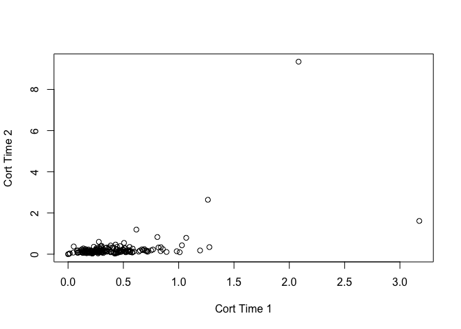
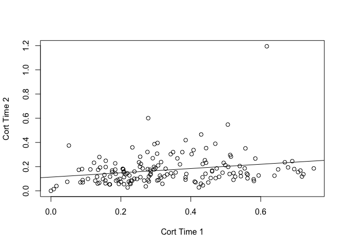
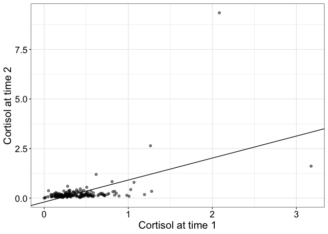
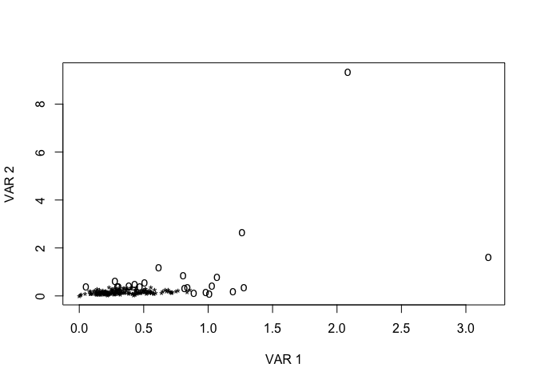
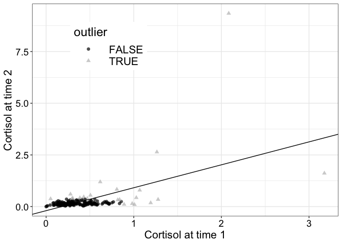
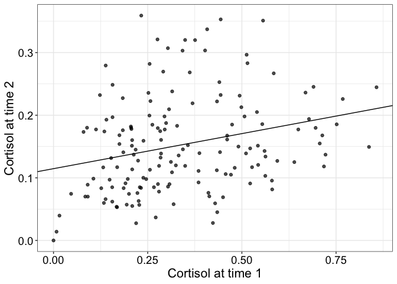

Regression example
================
Guillaume A. Rousselet & Rand R. Wilcox
2024-05-22

# Dependencies

``` r
library(tibble)
library(ggplot2)
source("./code/functions.R")
source("./code/regfun.R")
source("./code/theme_gar.txt")
library(cowplot)
```

# Load data

Data from Clark et al. (2012).

``` r
A1 <- read.table(file = "./data/A1_dat.txt")
d <- cbind(A1$cort1,A1$cort3)
d <- elimna(d) # remove NA
df <- tibble(x = d[,1], y = d[,2])
```

# Plot all data

``` r
plot(d[,1], d[,2], xlab='Cort Time 1', ylab='Cort Time 2')
```

<!-- -->

# Regression

``` r
reg.fit <- lm(data = df, formula = y ~ x)$coefficients
```

# Correlation

``` r
cor.fit <- cor.test(x = df[[1]], y = df[[2]])
```

Pearson’s correlation = 0.52 \[0.41, 0.62\], *p*=5.7379493^{-14}.

## Eliminate univariate outliers only

Eliminate only outliers along x-axis (leverage points). See chapter 9 in
Wilcox (2022).

``` r
# d=elimna(cbind(A1$cort1,A1$cort2))
id <- outpro(d[,1])$keep
plot(d[id,1], d[id,2], xlab='Cort Time 1', ylab='Cort Time 2')
abline(ols(d[id,1], d[id,2])$coef)
```

<!-- -->

``` r
pcor(d[id,1], d[id,2]) # Pearson .419
```

    ## $cor
    ## [1] 0.2366218
    ## 
    ## $p.value
    ## [1] 0.002357615

## Robust correlation

Use skipped correlation: remove multivariate outliers defined using
robust projection method, then compute Pearson correlation using
remaining points. Test statistic is adjusted to take outlier removal
into account (Pernet, Wilcox & Rousselet, 2013).

``` r
scor(x = d[,1], y = d[,2], SEED=FALSE)
```

    ## $cor
    ## [1] 0.2666455
    ## 
    ## $test.stat
    ## [1] 3.68075
    ## 
    ## $crit.05
    ## [1] 2.35851

# Scatterplot

``` r
ggplot(df, aes(x=x, y=y)) + theme_gar +
  geom_point(alpha = 0.5) +
  labs(x = "Cortisol at time 1",
       y = "Cortisol at time 2") +
  geom_abline(intercept = reg.fit[1], slope = reg.fit[2])
```

<!-- -->

# Flag multivariate outliers

``` r
out.res <- outpro(d)
```

<!-- -->

# Scatterplot with colour-coded outliers

``` r
df <- tibble(x = d[,1], 
             y = d[,2],
             outlier = factor(!(1:length(d[,1]) %in% out.res$keep)))

pA <- ggplot(df, aes(x=x, y=y, colour = outlier, shape = outlier)) + theme_gar +
  geom_point(alpha = 0.7, size = 2) +
  scale_colour_manual(values = c("black", "grey")) + 
  labs(x = "Cortisol at time 1",
       y = "Cortisol at time 2") +
  geom_abline(intercept = reg.fit[1], slope = reg.fit[2]) +
  theme(legend.position = c(.25, .8)) 
pA
```

<!-- -->

# Scatterplot without multivariate outliers

``` r
df.out <- tibble(x = d[out.res$keep,1],
                 y = d[out.res$keep,2])

reg.fit.out <- lm(data = df.out, formula = y ~ x)$coefficients
#cor.fit <- cor.test(x = df.out[[1]], y = df.out[[2]])

pB <- ggplot(df.out, aes(x=x, y=y)) + theme_gar +
  geom_point(alpha = 0.7) +
  labs(x = "Cortisol at time 1",
       y = "Cortisol at time 2") +
  geom_abline(intercept = reg.fit.out[1], slope = reg.fit.out[2])
pB
```

<!-- -->

## Merge panels

``` r
cowplot::plot_grid(pA, pB, 
                   labels = c("A", "B"),
                   label_size = 20,
                   ncol = 2)
ggsave(filename = "./figures/reg.pdf", width = 9, height = 4)
```

# References

Clark, F., Jackson, J., Carlson, M., Chou, C.-P., Cherry, B. J.,
Jordan-Marsh, M., Knight, B. G., Mandel, D., Blanchard, J., Granger, D.
A., Wilcox, R. R., Lai, M. Y., White, B., Hay, J., Lam, C., Marterella,
A., & Azen, S. P. (2012). Effectiveness of a lifestyle intervention in
promoting the well-being of independently living older people: Results
of the Well Elderly 2 Randomised Controlled Trial. J Epidemiol Community
Health, 66(9), 782–790. <https://doi.org/10.1136/jech.2009.099754>

Pernet, C. R., Wilcox, R. R., & Rousselet, G. A. (2013). Robust
Correlation Analyses: False Positive and Power Validation Using a New
Open Source Matlab Toolbox. Frontiers in Psychology, 3.
<https://doi.org/10.3389/fpsyg.2012.00606>

Wilcox, R. R. (2022). Introduction to Robust Estimation and Hypothesis
Testing (5th ed.). Academic Press.
